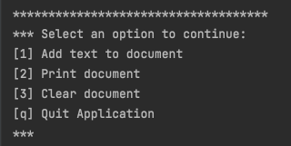
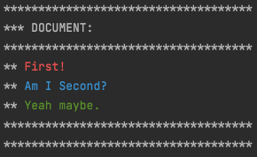
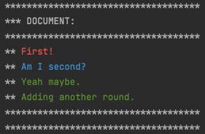
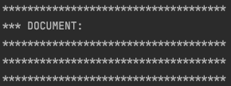
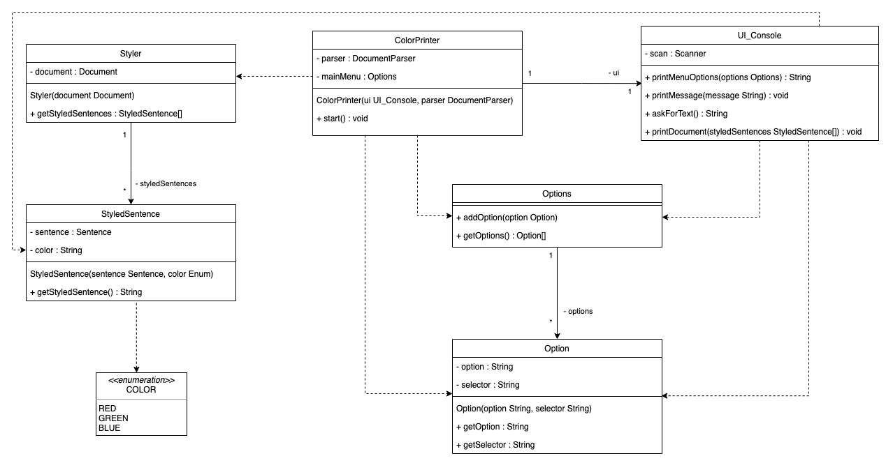

# Color Printer

## About
This is a simple console app that will print added input as a list of sentences in different colors depending on the sentence type. Regular sentences ending with a dot are green, questions ending with a questionmark are blue and sentences ending with an exclamation mark are red. 

## Example
### Main menu
Type `1`, `2`, `3` or `q` and press the `ENTER`-button to choose an option from the menu. 

### Add text to document
Choose the option `1` in the Main Menu. Type `First! Am I Second? Yeah maybe.` and press the `ENTER`-button. When the menu reprints itself, and you choose the option `2` to print the current document. The document will be displayed as shown in the image below.

You can continue with choosing the option `1` again from the Main Menu and this time type `Adding another one.`. This time when printing the document should look like the image below.

### Clear the document
By choosing option `3` in the Main Menu you will empty the document from all sentences. By printing the document again with the option `2` in the Main Menu you should get the result as displayed below.

## Class Diagram

## Manage Depencencies
This is an example for how to manage the dependencies of [Tokenizer](https://gitlab.lnu.se/1dv610/student/pr222ja/l1) and [Parser](https://gitlab.lnu.se/1dv610/student/pr222ja/l2).

You may have another prefered way of handling dependencies, whichever works best for you.

The main focus here is how to add a .jar-file of the Tokenizer and Parser in a way that matches the current build.gradle file. You should have some basic knowledge of how to use gradle as potential build steps and such may not be specified here.

### Files and folders
- Create a folder called `libs` in the project root.
- Add the `lab1-1.1-SNAPSHOT.jar`-file (the Tokenizer) to the 'libs' folder.
- Add the `l2-1.0.jar`-file (the Parser) to the 'libs' folder.
- If you don't already have the .jar-files, follow the next section to create them, and then add them.

### Creating the jar-file
- Download [Tokenizer](https://gitlab.lnu.se/1dv610/student/pr222ja/l1) and [Parser](https://gitlab.lnu.se/1dv610/student/pr222ja/l2) to your local computer.
- Open the repositories and run the gradle task of publishing to MavenLocal for each repository.
- Find the `.m2`-folder on your local computer and look for the files in `.m2/repository/org/example/lab1/1.1-SNAPSHOT/lab1-1.1-SNAPSHOT.jar` for the Tokenizer and `.m2/repository/org/example/l2/1.0/l2-1.0.jar` for the Parser. 
- Now add the created .jar-file to this project's 'libs'-folder.