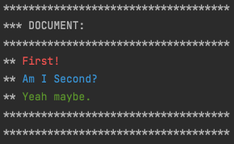
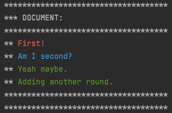
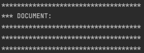

# Manual Test Specifications

## TC1 - Different types of sentences prints in different colors
### Prerequisite: none
### Steps
1. Run App.java
2. Type `1` and push Enter.
3. Type `First! Am I Second? Yeah Maybe.`
4. Type `2` and push Enter.
#### Expected result

## TC2 - Add a sentence to a document with previous sentences
### Prerequisite: TC1
### Steps
1. Type `1` and push Enter.
2. Type `Adding another round.`
3. Type `2` and push Enter.
#### Expected result

## TC3 - Clearing the document from sentences
### Prerequisite: TC1 or TC2.
1. Type `3` and push Enter.
2. Type `2` and push Enter.
#### Expected result

## TC4 - Quitting the application
### Prerequisite: Step 1 in TC1 or just make sure that the application is running.
### Steps
1. Type `q` and push Enter.
### Expected Result
- The application should stop running.

## TC5 - Expected errors
### Prerequisite: TC1.
### Steps for all test variants:
1. Type `1` and push Enter.
2. Type the input-string to be tested.
3. Expected error-message should be printed. 
4. Type `2` and push Enter.
5. Expected effects of the document should be printed.

## TC5.1 - Invalid sentence, without words
2. Type `!!`.
### Expected error-message
- `Invalid sentence, a sentence must have at least one word`
### Expected effect on document
- Nothing new should be added to the document.

## TC5.2 - Invalid sentence, after some sentence
2. Type `So? !!`
### Expected error-message
- `Invalid sentence, a sentence must have at least one word`
### Expected effect on document
- A line with `So?` in blue should have been added to the document.

## TC5.3 - Invalid sentence, with valid sentence after
2. Type `So? !! But.`
### Expected error-message
- `Invalid sentence, a sentence must have at least one word`
### Expected effect on document
- A line with `So?` in blue should have been added to the document. Should NOT have an added line with `But.`

## TC5.4 - Invalid token, before completing sentence
2. Type `So ) .`
### Expected error-message
- `Could not make a valid matched token!`
### Expected effect on document
- Nothing new should be added to the document.

## TC5.5 - Invalid token, valid sentences before and after the token
2. Type `So? ) But.`
### Expected error-message
- `Could not make a valid matched token!`
### Expected effect on document
- Nothing new should be added to the document. 
- Note that this error does not add `So?` to the document like it does in TC5.3.